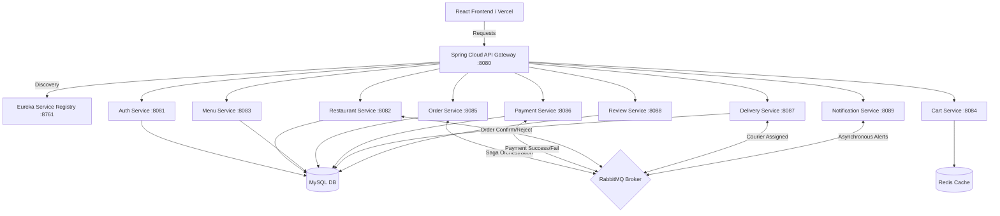

# 🍔 QuickBite - Microservices Food Delivery Platform

[](https://react.dev/)
[](https://spring.io/projects/spring-boot)
[](https://www.docker.com/)
[](https://www.mysql.com/)
[](https://www.rabbitmq.com/)
[](https://redis.io/)
[](https://vercel.com/)

QuickBite is an enterprise-grade, distributed **Food Delivery Platform** built using a robust **Microservices Architecture**. The platform is designed to handle high concurrency, asynchronous event-driven communications, and distributed transactional consistency across multiple microservices.

---

## 🌐 Live Deployments & URLs

The platform uses a **Hybrid Cloud Architecture** that hosts the frontend React application on Vercel while tunneling backend APIs from local Docker environments seamlessly.

* **Live Website (Frontend):** 🔗 [https://online-food-delivery-platform.vercel.app/](https://online-food-delivery-platform.vercel.app/)
* **Globally Accessible API Gateway:** 🔗 `https://quickbite-backend-amit.loca.lt`
* **Integrated Swagger OpenAPI UI:** 🔗 [Swagger Dashboard](https://quickbite-backend-amit.loca.lt/webjars/swagger-ui/index.html)

---

## 🏗️ System Architecture & Microservices

The platform consists of **9 business microservices** alongside **3 infrastructure services** orchestrating routing, discovery, and message brokering:



### Microservice Directory:
1. **Eureka Server (`eureka-server`):** Service registry and discovery tool.
2. **API Gateway (`api-gateway`):** Integrated single-entry point with Global CORS handling, JWT Authentication Filters, and Aggregated Swagger Documentation UI.
3. **Auth Service (`auth-service`):** Secure login, user registration, JWT generation, and validation.
4. **Restaurant Service (`restaurant-service`):** Managing restaurant listings, opening statuses, and restaurant registration.
5. **Menu Service (`menu-service`):** Dynamic food item catalogues, categorization, and pricing.
6. **Cart Service (`cart-service`):** High-speed, transient shopping cart persistence using **Redis Cache**.
7. **Order Service (`order-service`):** Core order lifecycle handling, checkout logic, and distributed Saga orchestration coordinator.
8. **Payment Service (`payment-service`):** Internal user wallets, virtual balances, and payment transactions.
9. **Delivery Service (`delivery-service`):** Delivery agent assignment, courier statuses, and real-time transit status tracker.
10. **Review Service (`review-service`):** Restaurant/food review aggregation and stars rating manager.
11. **Notification Service (`notification-service`):** Asynchronous email and alert dispatcher using **RabbitMQ** event queue consumers.

---

## ⚡ Key Technical Features & Abstractions

* **Distributed Consistency (Saga Pattern):** Uses asynchronous event-driven orchestration over **RabbitMQ** queues to handle multi-step checkouts (Order Created ➡️ Wallet Charged ➡️ Restaurant Accepted ➡️ Delivery Agent Assigned) with automatic compensating transactions (rollback) on step failures.
* **Global Exception Handling:** Unified `@RestControllerAdvice` mapping across all Java microservices for clean, structured JSON error payloads.
* **Aggregated Swagger Dashboard:** Single OpenAPI 3 UI gateway aggregating documentation schemas from all active services in a clean drop-down menu.
* **Localtunnel warning bypass:** Proactively resolves localtunnel phishing screens in the React Axios client using the custom `bypass-tunnel-reminder` headers.

---

## 🚀 How to Run the Project Locally

Follow these quick steps to get the entire multi-service platform up and running on your machine:

### 1. Prerequisites
- [Docker Desktop](https://www.docker.com/products/docker-desktop/) installed and running.
- Node.js installed on your machine.

### 2. Launch the Microservices Stack
1. Open Docker Desktop.
2. Navigate to the `quickbite` folder:
   ```bash
   cd quickbite
   ```
3. Boot up the 11 containers:
   ```bash
   docker-compose up -d
   ```

### 3. Open the Internet Bridge (Tunnel)
1. Navigate back to the root of the workspace.
2. Double-click the pre-configured shortcut:
   👉 **`start-backend-tunnel.bat`**
   *(This launches localtunnel on port 8080 and registers the permanent subdomain `https://quickbite-backend-amit.loca.lt`)*.

### 4. Visit the Live Frontend
Open [https://online-food-delivery-platform.vercel.app/](https://online-food-delivery-platform.vercel.app/) on your phone or laptop. 
* *Note: On the first launch, bypass the localtunnel landing page by entering the host IP `104.28.155.91`.*
